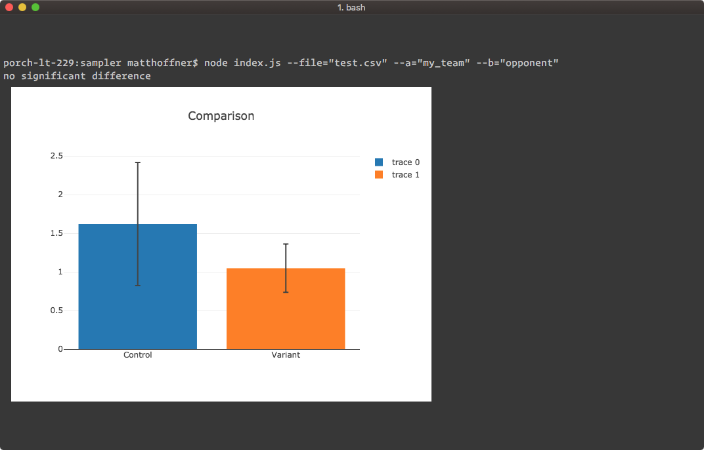

# signifier

Node.js cli for calculating significance, creating error bar charts in terminals:

`npx signifier --file="test.csv" --a="control" --b="variant" --i=1000`

Will save a screenshot with error bar chart after running analysis. Requires iTerm 2 or newer to display charts.

#### Inspiration

- term-img
- plotly
- puppeteer
